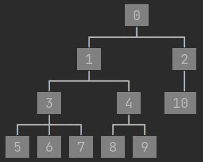
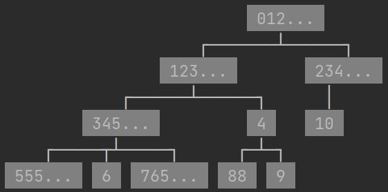
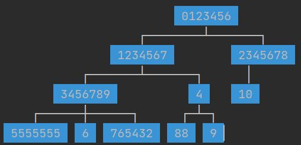
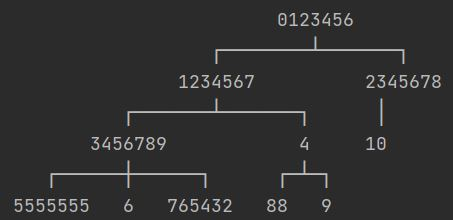
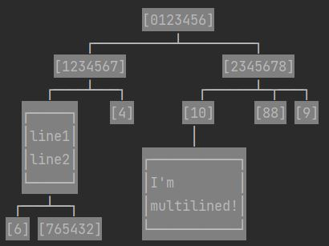
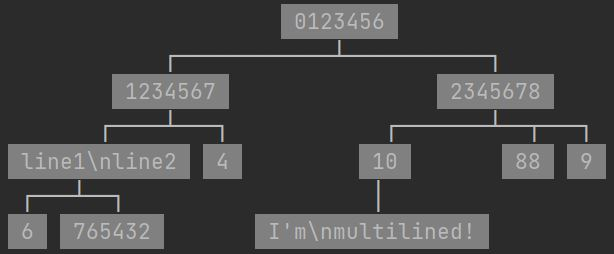

# PrettyPrintTree

This package allows you to print the tree datastructure in a readable fashion (in C#).

It supports trees with any kind of data (as long it can be turned into a string).

And even supports multi lined nodes (as in strings with \n).




# Documentation

I tried to make this as flexible as possible, so in order to support multiple types of trees
you need to explain to the program how to print your tree. The way to accomplish this is by passing 2 lambdas:
1) getChildren: Given a node of your tree type returns an IEnumerable of all its children (from left to right).
    For example if this is your tree implementation:
    ```csharp
    class Tree<T>{
        private T val;
        private List<Tree<T>> children;
        public Tree(T val){
            this.val = val;
            children = new List<Tree<T>>();
        }
        public Tree<T> AddChild(T child){
            var c = new Tree<T>(child);
            children.Add(c);
            return c;
        }
        public T GetValue() => this.val;
        public List<Tree<T>> GetChildren() => this.children;
    }
    ```
    Then getChildren would be as simple as:
    ```csharp
    node => node.GetChildren()
    ```
    Or if your tree implementation is:
    ```csharp
    class Tree<T>{
        private T val;
        private Tree<T>? rChild, lChild;

        public Tree(T val){ this.val = val; }

        public void SetRightChild(T child){
            rChild = new Tree<T>(child);
        }
        public void SetLeftChild(T child){
            lChild = new Tree<T>(child);
        }
        public T GetValue() => this.val; 
        public Tree<T>? GetRChild() => this.rChild; 
        public Tree<T>? GetLChild() => this.lChild;
    }
    ```
    Then get_children would be:
    ```csharp
    node => new[]{ node.GetLChild(), node.GetRChild() }
    ```

2) getValue: Given a node of your tree type returns that node's value
    for example if your tree implementation has:
    ```csharp
    public string GetValue(){/*...*/}
    ```
    then getValue would be:
    ```csharp
    (node) => node.GetValue()
    ```


In order to print the tree you first need to make a PrettyPrintTree object which you pass your lambdas (and any other settings) to, then you can call it whenever you want without needing to pass the lambdas each time.


## Examples

```csharp
class Tree<T>{
    private T val;
    private List<Tree<T>> children;
    public Tree(T val){
        this.val = val;
        children = new List<Tree<T>>();
    }
    public Tree<T> AddChild(T child){
        var c = new Tree<T>(child);
        children.Add(c);
        return c;
    }
    public T GetValue() => this.val;
    public List<Tree<T>> GetChildren() => this.children;
}


public class Test{
    static void Main(string[] args){
        var tree = new Tree<string>("0");
        var c1 = tree.AddChild("1");
        var c2 = tree.AddChild("2");
        var c1_1 = c1.AddChild("3");
        var c1_2 = c1.AddChild("4");
        c1_1.AddChild("5");
        c1_1.AddChild("6");
        c1_1.AddChild("7");
        c1_2.AddChild("8");
        c1_2.AddChild("9");
        c2.AddChild("10");
        var pt = new PrettyPrintTree<Tree<string>>(
            getChildren: (node) => node.GetChildren(),
            getVal: (node)=> node.GetValue()
        );
        pt.Display(tree);
    }
}
```


# Other Settings


## Trim
Say you only want to print the first few characters of each node (in order to keep the tree small for readability),
then you can set trim to a specific amount of characters.

```csharp
var pt = new PrettyPrintTree<Tree<string>>(
    getChildren: (node) => node.GetChildren(),
    getVal: (node) => node.GetValue(),
    trim: 3
);
```



## Return Instead of Print
Instead of printing the tree it can return the string instead if you prefer.

Instead of calling
```csharp
pt.Display(tree);
```
You can call
```csharp
string res = pt.ToStr(tree);
```


## Color
You can change the bg color of each node, or even just not use color.

```csharp
var pt = new PrettyPrintTree<Tree<string>>(
    getChildren: (node) => node.GetChildren(),
    getVal: (node) => node.GetValue(),
    color: Color.BLUE
);
```

```csharp
var pt = new PrettyPrintTree<Tree<string>>(
    getChildren: (node) => node.GetChildren(),
    getVal: (node) => node.GetValue(),
    color: Color.NONE
);
```



## Border
You can also surround each node with a little border:
```csharp
var pt = new PrettyPrintTree<Tree<string>>(
    getChildren: (node) => node.GetChildren(),
    getVal: (node) => node.GetValue(),
    border: true
);
```



## Escape NewLines
You can escape \n so that each node will be printed on one line.

Note: \\n will be escaped into \\\\n so that you can tell the difference
```csharp
var pt = new PrettyPrintTree<Tree<string>>(
    getChildren: (node) => node.GetChildren(),
    getVal: (node) => node.GetValue(),
    escapeNewline: true
);
```



## Max Depth
You can specify a max depth so that it will only print nodes up to that depth.
This can be done either at the start:
```csharp
var pt = new PrettyPrintTree<Tree<string>>(
    getChildren: (node) => node.GetChildren(),
    getVal: (node) => node.GetValue(),
    maxDepth: 2
);
```
Or when calling the function:
```csharp
pt.Display(tree, depth: 2);
```
This will override the max depth set at the start (if any) for this time only.
To have no max depth, you can set it to -1.


## Dictionaries \ JSON

Coming soon


## Labels

Coming soon


# Horizontal

Coming soon